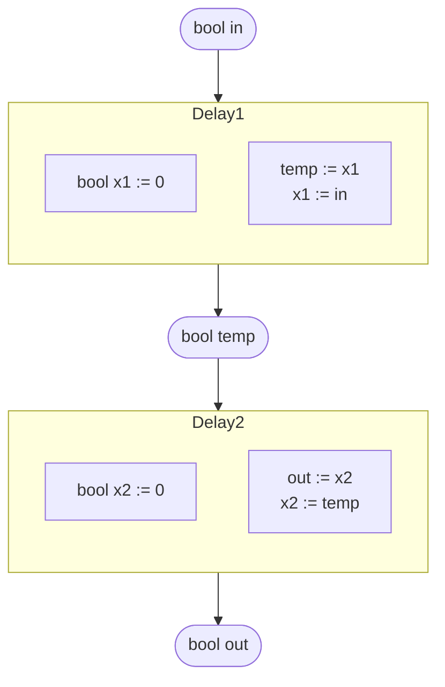
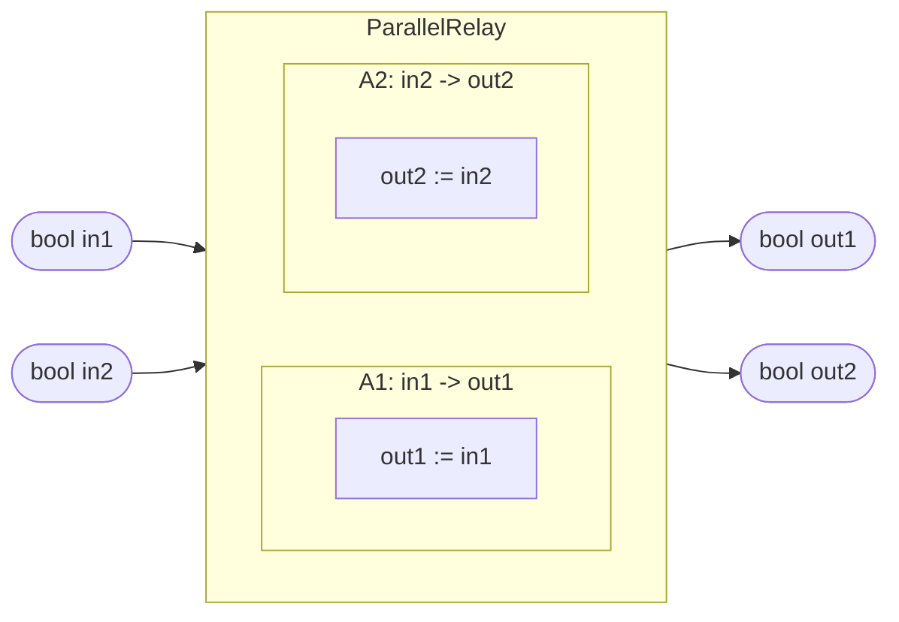

```latex
\[
(\text{off},0)\xrightarrow{0}(\text{off},0)\xrightarrow{1}(\text{on},0)
\xrightarrow{0}(\text{on},1)\xrightarrow{0}(\text{on},2)\xrightarrow{0}\cdots
\xrightarrow{0}(\text{on},10)\xrightarrow{0}(\text{off},0)
\]
```

What happens:

- The system state is a pair $(\text{mode}, x)$, where $\text{mode}\in\{\text{off},\text{on}\}$ and $x$ is a counter.
- Starting at $(\text{off},0)$:
  - Input $0$ keeps it in $(\text{off},0)$ (no change while off).
  - Input $1$ switches the mode to **on** and sets/keeps the counter at $0$: $(\text{off},0)\to(\text{on},0)$.
  - Each subsequent input $0$ while in **on** increments the counter: $(\text{on},k)\to(\text{on},k+1)$, so it goes $(\text{on},0)\to(\text{on},1)\to\cdots\to(\text{on},10)$.
  - The final $0$ causes a transition back to **off** and resets the counter to $0$: $(\text{on},10)\to(\text{off},0)$ (this corresponds to the condition like $x\ge 10$ triggering a reset when the relevant input occurs).

So overall: one “press” ($1$) turns the switch on, then repeated $0$ inputs count up to 10, and after reaching the threshold it turns off and resets.






```mermaid
flowchart LR
  %% external ports
  in1([in1]) --> C
  in2([in2]) --> C
  C --> out1([out1])
  C --> out2([out2])
  C --> out3([out3])

  %% component
  subgraph C[""]
    direction TB
    hdr["x1, x2"]:::hdr
    body["local y"]:::body

    %% place actions in a 2x2-like layout using subgraphs
    subgraph ROW1[""]
      direction LR
      A1["A1: x1, in1 -> y, x1"]:::act
      A3["A3: x1, in1 -> out1, x1"]:::act
    end

    subgraph ROW2[""]
      direction LR
      A2["A2: x2 -> out2"]:::act
      A4["A4: in2, y, out2 -> x2, out3"]:::act
    end
  end

  %% internal connections (conceptual wires)
  in1 -.-> A1
  in1 -.-> A3
  A1 -->|y| A4
  in2 -.-> A4
  A2 -->|out2| A4
  A3 -.-> out1
  A2 -.-> out2
  A4 -.-> out3

  classDef act fill:#ffffff,stroke:#2f7d6b,stroke-width:1px,rx:6,ry:6;
  classDef hdr fill:#ffffff,stroke:#2f7d6b,stroke-width:1px;
  classDef body fill:#ffffff,stroke:#ffffff,stroke-width:0px,color:#1f1f1f;
  ```
  